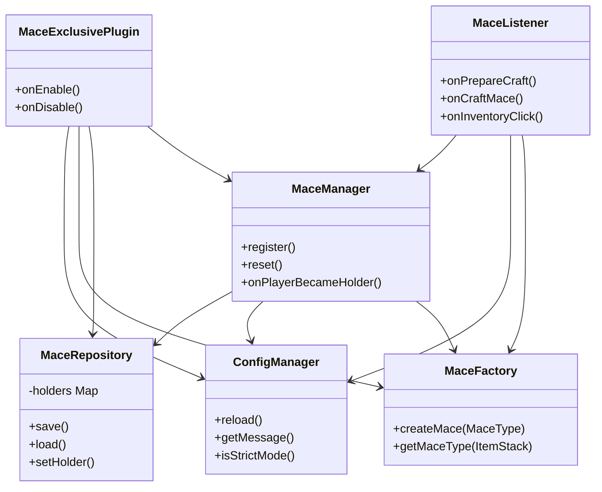

# Mace-Exclusive.  

<div align="center">


[](https://jdk.java.net/21/)
[](https://www.spigotmc.org/)
[](https://gradle.org/)
[](./LICENSE)

**Standalone Powerful Mace Plugin** 🛠️

A unique singleton weapon mechanic with custom effects, strict inventory tracking, and fully configurable settings.
Originally part of **SabíSMP**, now a dedicated plugin.

[Features](#features) • [Installation](#installation) • [Commands](#commands) • [Permissions](#permissions) • [Building](#building-from-source) • [Support](#support)

</div>

---
## Features

### 🔨 Limits the Power of the MACE
A legendary weapon with unique mechanics:
*   **Singleton Existence**: Only **ONE** Mace can exist on the server at a time (configurable).
*   **Custom Recipe**
* 
*   **Strict Mode** (Refined):
    *   **Allowed**: Anvil, Enchanting Table, Player Inventory.
    *   **Blocked**: Storing in Chests, Shulkers, Barrels, etc.
    *   **Blocked**: Dropping the item (if strict mode is enabled).

### ✨ Effect Mace (Visuals & Combat)
*   **First Craft**: Player glows for 5 minutes (configurable) upon crafting.
*   **Passive**:
    *   *Holding*: Optional Glowing effect and Soul Particles.
*   **Combat**:
    *   *Ground Slam*: Hitting an entity causes blocks around to "jump" (visual effect).
    *   *Kill Message*: Custom chat message when killing a player.

### 🔮 Custom Mace: Mace Chaos (The Glitch)
A corrupted variant with chaotic properties and void origins:
*   **Hard Recipe**:
    *   Requires **3x Dark Ego** (custom `NETHER_STAR` items with the `egosmp:dark_ego` PDC tag), **2x Heavy Core**, **1x Mace**, and **3x Wither Rose**.
    *   
*   **Self-Curse**: Wither II and Inventory Shuffling (periodically shuffles hotbar and main inventory slots 0-35) for 10 seconds upon crafting or picking up.
*   **Combat Effects**:
    *   **Glitch Strike**: 10-20% chance (configurable) to corrupt the victim's inventory, forcing periodic slot shuffling for 5-10 seconds.
    *   **Glitch Kill**: Overrides standard death messages to obfuscate the killer's identity (e.g. `Victim was OBLITERATED by §kERROR_404`).

---

## Infrastructure & Project Structure

The project follows a modular Spigot/Paper plugin directory structure:
```
Mace-Exclusive/
├── src/main/java/vn/nirussv/maceexclusive/
│   ├── command/      # Command handler and tab completer (/macee)
│   ├── config/       # Configuration and Language loader (Adventure API)
│   ├── listener/     # Spigot Event Listeners (Strict Mode, Combat, Effects)
│   ├── mace/         # Core weapon logic, state persistence, factory pattern
│   ├── task/         # Bukkit Runnables (Active particles, inventory shuffler)
│   └── MaceExclusivePlugin.java # Plugin entry point & lifecycle hooks
└── src/main/resources/
     ├── config.yml    # Configuration properties & toggles
     ├── lang_en.yml   # English localization
     ├── lang_vi.yml   # Vietnamese localization
     └── plugin.yml    # Plugin declaration & commands
```

## Architectural Design

The plugin is designed with clean OOP principles and separation of concerns:



### Key Components

1. **State & Registry Persistence (`MaceRepository`)**:
   - Manages an in-memory `EnumMap<MaceType, UUID>` mapping each singleton mace to its current holder's UUID.
   - Automatically saves and loads state to/from a dedicated `mace-data.yml` file to ensure consistency across server restarts.

2. **Creation Decoupling (`MaceFactory`)**:
   - Compiles custom `ItemStack` representations of maces using configured names, custom model data, and lore.
   - Sets a `PersistentDataContainer` (PDC) byte tag on the item (e.g. `mace_power_item` or `mace_chaos_item`) to uniquely identify the weapon instance across the server.

3. **Business Logic orchestrator (`MaceManager`)**:
   - Mediates state changes, checks if a mace type can be crafted, registers new maces, and processes holder transition effects (Glowing potion effects, Adventure Titles, and global coordinate broadcasts).

4. **Strict Inventory Control (`MaceListener`)**:
   - Blocks storage of registered maces inside unauthorized containers (Chests, Shulker Boxes, Barrels, etc.) while allowing utility blocks like Anvils, Crafting Tables, and Enchanting Tables.
   - Provides an optional `strict-mode-drop` mechanism that drops the mace at the player's feet if they try to bypass the container restriction.
   - Blocks automated Hopper extraction and Crafter blocks from manipulating registered maces.

---

## Installation

1.  **Download**: Get the latest JAR from [Modrinth](https://modrinth.com/).
2.  **Install**: Drop the file into your server's `plugins/` folder.
3.  **Restart**: Start your server to generate configuration files.
4.  **Configure**: Edit files in `plugins/Mace-Exclusive/`:
    *   `config.yml`: Feature toggles (Strict mode, recipes, combat stats)
    *   `lang_en.yml` / `lang_vi.yml`: Custom localization strings
5.  **Reload**: Use `/macee reload` to apply configuration changes live.

---

## Commands

| Command | Description | Permission |
|---------|-------------|------------|
| `/macee help` | Show the plugin help menu | `mace.use` |
| `/macee info [power\|chaos]` | View current holder and coordinate location of the selected Mace type | `mace.use` |
| `/macee give [power\|chaos]` | **Admin**: Gives the selected Mace type to the player executing the command | `mace.admin` |
| `/macee reset [power\|chaos]` | **Admin**: Resets registration status, allowing the selected Mace type to be crafted again | `mace.admin` |
| `/macee reload` | **Admin**: Reloads plugin configuration and localization files | `mace.admin` |

*Note: If no mace type is specified, commands default to the `power` mace.*

---

## Permissions

| Permission | Default | Description |
|------------|---------|-------------|
| `mace.use` | true | Allows usage of `/macee help` and `/macee info` |
| `mace.admin` | op | Allows access to `/macee give`, `/macee reset`, `/macee reload`, and bypasses strict mode container block restrictions |

---

## Building from Source

### Prerequisites
*   [JDK 21](https://jdk.java.net/21/) or newer
*   Git

### Build Steps

1.  **Clone the repository:**
    ```bash
    git clone https://github.com/ego-smp-labs/Mace-Exclusive-Plugin.git
    cd Mace-Exclusive-Plugin
    ```

2.  **Build with Gradle:**
    We wrap Gradle, so you don't need it installed globally.
    
    *   **Windows (PowerShell):**
        ```powershell
        ./gradlew build -x test
        ```
    *   **Linux/macOS:**
        ```bash
        ./gradlew build -x test
        ```

3.  **Locate the Artifact:**
    The compiled JAR file will be located at:
    `build/libs/Mace-Exclusive-1.0.0.jar`

> **Note**: We skip tests (`-x test`) during build usually, but you can run them with `./gradlew test`.

---

## License

Distributed under the MIT License. See `LICENSE` for more information.

Copyright © 2026 **NirussVn0** and **Ego SMP Labs**.

---

## Support

If you find any issues or have suggestions, please open an issue on [GitHub](https://github.com/ego-smp-labs/Mace-Exclusive-Plugin/issues).

donate: [paypal](https://www.paypal.com/paypalme/nirussvn0)