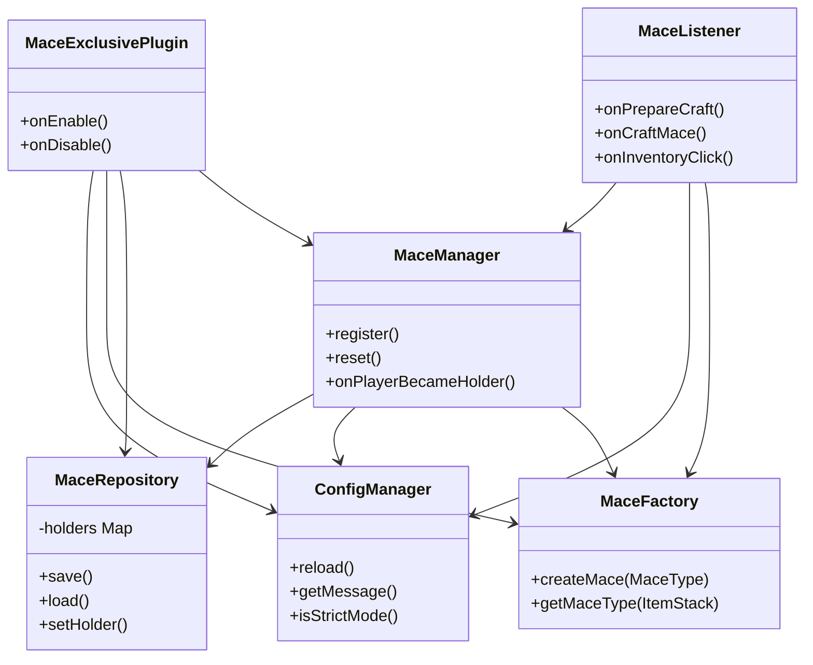

# Architectural Design & Development Guide

This document describes the internal structure, design patterns, and building process of the **Mace-Exclusive** plugin.

---

## Infrastructure & Project Structure

The project follows a modular Spigot/Paper plugin directory structure:
```
Mace-Exclusive/
├── src/main/java/vn/nirussv/maceexclusive/
│   ├── command/      # Command handler and tab completer (/macee)
│   ├── config/       # Configuration and Language loader (Adventure API)
│   ├── listener/     # Spigot Event Listeners (Strict Mode, Combat, Effects)
│   ├── mace/         # Core weapon logic, state persistence, factory pattern
│   ├── task/         # Bukkit Runnables (Active particles, inventory shuffler)
│   └── MaceExclusivePlugin.java # Plugin entry point & lifecycle hooks
└── src/main/resources/
     ├── config.yml    # Configuration properties & toggles
     ├── lang_en.yml   # English localization
     ├── lang_vi.yml   # Vietnamese localization
     └── plugin.yml    # Plugin declaration & commands
```

---

## Architectural Design

The plugin is designed with clean OOP principles and separation of concerns:



### Key Components

1. **State & Registry Persistence (`MaceRepository`)**:
   - Manages an in-memory `EnumMap<MaceType, UUID>` mapping each singleton mace to its current holder's UUID.
   - Automatically saves and loads state to/from a dedicated `mace-data.yml` file to ensure consistency across server restarts.

2. **Creation Decoupling (`MaceFactory`)**:
   - Compiles custom `ItemStack` representations of maces using configured names, custom model data, and lore.
   - Sets a `PersistentDataContainer` (PDC) byte tag on the item (e.g. `mace_power_item` or `mace_chaos_item`) to uniquely identify the weapon instance across the server.

3. **Business Logic orchestrator (`MaceManager`)**:
   - Mediates state changes, checks if a mace type can be crafted, registers new maces, and processes holder transition effects (Glowing potion effects, Adventure Titles, and global coordinate broadcasts).

4. **Strict Inventory Control (`MaceListener`)**:
   - Blocks storage of registered maces inside unauthorized containers (Chests, Shulker Boxes, Barrels, etc.) while allowing utility blocks like Anvils, Crafting Tables, and Enchanting Tables.
   - Provides an optional `strict-mode-drop` mechanism that drops the mace at the player's feet if they try to bypass the container restriction.
   - Blocks automated Hopper extraction and Crafter blocks from manipulating registered maces.

---

## Building from Source

### Prerequisites
*   [JDK 21](https://jdk.java.net/21/) or newer
*   Git

### Build Steps

1. **Clone the repository:**
   ```bash
   git clone https://github.com/ego-smp-labs/Mace-Exclusive-Plugin.git
   cd Mace-Exclusive-Plugin
   ```

2. **Build with Gradle:**
   If you do not have Gradle installed globally, you can download Gradle and execute it or use standard:
   ```bash
   gradle build -x test
   ```

3. **Locate the Artifact:**
   The compiled JAR file will be located at:
   `build/libs/Mace-Exclusive-1.0.1.jar`
