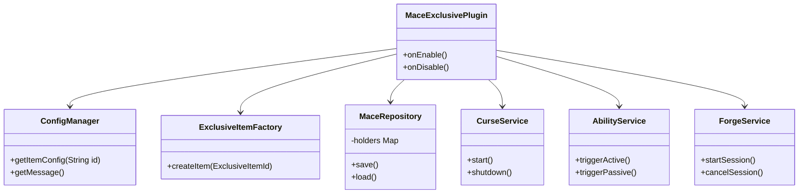

# Architectural Design & Development Guide

This document describes the internal structure, design patterns, and building process of the **Mace-Exclusive** plugin following its Vanilla-like refactor (Paper 1.21.11+).

---

## Infrastructure & Project Structure

The project follows a modular, feature-based Spigot/Paper plugin directory structure designed for Java 21:

```text
Mace-Exclusive/
├── src/main/java/vn/nirussv/maceexclusive/
│   ├── ability/      # Active and Passive skill routing, Cooldown Service
│   ├── command/      # Command handler and tab completer (/macee)
│   ├── config/       # Strongly typed config objects, individual item config loader, Language (Adventure API)
│   ├── curse/        # Event-driven Curse Engine and Attribute Lease management
│   ├── effect/       # Particle, Sound, and Freeze services
│   ├── forge/        # Awakening Sessions and Holograms (TextDisplay)
│   ├── item/         # Item identity (PDC keys, ItemMatcher, ExclusiveItemFactory)
│   ├── listener/     # Specialized event listeners bridging to services
│   ├── mace/         # Legacy mace components / Core generic managers
│   ├── persistence/  # Flat-file data stores (Forge sessions, Ownership)
│   ├── projectile/   # Spear projectile entity tracking and logic
│   ├── recipe/       # Recipe registration and Unawakened item handling
│   └── MaceExclusivePlugin.java # Plugin entry point & dependency injection hub
└── src/main/resources/
    ├── config.yml    # Global performance and mechanic settings
    ├── lang_vi.yml   # Global Vietnamese language file
    ├── lang_en.yml   # Global English language file
    └── items/        # Individual weapon/item configuration files (e.g., power_mace.yml)
```

### Documentation Structure & Roles (`docs/`)

Thư mục `docs/` chứa toàn bộ tài liệu thiết kế kiến trúc, kế hoạch và báo cáo tiến độ của dự án. Hệ thống được tổ chức thành hai nhóm tài liệu chính nhằm tối ưu hóa tính ngắn gọn cho phiên làm việc hiện tại, đồng thời bảo tồn toàn bộ lịch sử phát triển:

#### 1. Giao diện gốc (Root Folder - Bản mới nhất)
Các tệp HTML ở gốc đóng vai trò là giao diện xem nhanh gọn, tập trung duy nhất vào Phase hoạt động hiện tại (Phase 2.1 - đúc Lodestone trực tiếp):
*   [plan.html](file:///b:/__JAVA__/Mace-Exclusive/docs/plan.html): Bản thiết kế tổng thể (Master Plan) trình bày chi tiết về thông số vũ khí, lõi biến dị, công thức chế tạo và các hiệu ứng kỹ năng của phiên bản mới nhất.
*   [scratch_base_todo.html](file:///b:/__JAVA__/Mace-Exclusive/docs/scratch_base_todo.html): Danh sách việc cần làm (TodoList) và Manual Test Checklist hiện tại của Phase 2.1 để kiểm tra chất lượng trước khi bàn giao.
*   [implementation_tickets.html](file:///b:/__JAVA__/Mace-Exclusive/docs/implementation_tickets.html): Vé triển khai kỹ thuật (Technical Tickets) đang hoạt động trong Phase 2.1 (gồm Ticket 3 - Forge Pipeline và Ticket 7 - Atomic Reservation & Abuse Tests).
*   [implementation_report.html](file:///b:/__JAVA__/Mace-Exclusive/docs/implementation_report.html): Báo cáo tóm tắt các tính năng đã được kiểm tra và triển khai thành công cho Phase 2.1.
*   [ARCHITECTURE.md](file:///b:/__JAVA__/Mace-Exclusive/docs/ARCHITECTURE.md): (Chính là tài liệu này) Bản đặc tả kiến trúc kỹ thuật mới nhất của hệ thống, được lưu trực tiếp tại thư mục gốc.

#### 2. Tài liệu lưu trữ (Archive Folder - Toàn bộ lịch sử)
Các tệp Markdown (`.md`) nằm trong thư mục `docs/archive/` đóng vai trò là kho lưu trữ lịch sử sửa đổi (historical logs) tích lũy qua tất cả các Phase từ đầu đến nay:
*   [SCRATCH_BASE_TODO.md](file:///b:/__JAVA__/Mace-Exclusive/docs/archive/SCRATCH_BASE_TODO.md): Lưu trữ toàn bộ lộ trình tiến độ, bao gồm các mốc công việc từ Milestone 0 đến 7 (Phase 1) và Milestone 8 (Phase 2.1).
*   [implementation_tickets.md](file:///b:/__JAVA__/Mace-Exclusive/docs/archive/implementation_tickets.md): Lưu giữ đầy đủ thông tin kỹ thuật của tất cả các vé từ Ticket 1 đến 7 của cả hai Phase.
*   [IMPLEMENTATION_REPORT.md](file:///b:/__JAVA__/Mace-Exclusive/docs/archive/IMPLEMENTATION_REPORT.md): Tổng hợp báo cáo kiểm thử và triển khai chi tiết qua từng giai đoạn phát triển của dự án.

---

## Architectural Design

The plugin is built upon decoupled Services, avoiding global singletons (except the main plugin instance) and preferring Constructor Dependency Injection.



### Key Components

1. **Item Identity & Factory (`item/`)**:
   - Items are identified universally by a single PersistentDataContainer tag (`mace_exclusive:item_id`), allowing unlimited future weapons.
   - `ItemMatcher` handles legacy keys automatically so old items aren't lost, and dynamically parses `Material` from strings to support non-vanilla items (e.g., ItemsAdder/Oraxen `NETHERITE_SPEAR`).

2. **Decoupled Item Configuration (`resources/items/`)**:
   - Each exclusive item has its own YAML file (e.g., `chaos_mace.yml`). This file contains the item's recipe, lore, specific cooldowns, attribute modifiers, and customized ability trigger messages.
   - This prevents `config.yml` from bloating and allows administrators to easily disable, tweak, or re-skin specific weapons.

3. **Strict Container Guard & Ownership (`MaceRepository` / `ContainerGuardListener`)**:
   - Enforces a singleton rule: Only one player can own a specific weapon type at a time.
   - Blocks items from entering Hoppers, Crafters, Dispensers, Shulkers, and Chests. Attempts to bypass this result in the item bouncing back.
   - **Protection against Loss/Dupe**: When dropped on the ground, the item is completely immune to destruction (Lava, Cactus, Explosion). It will not despawn. If thrown into the Void, the item is destroyed but its ownership is **not** automatically reset, requiring Server Admins to manually run `/macee reset` to resolve the lore continuity.
   - **Pickup Identification**: If an unauthorized player attempts to pick up a dropped exclusive weapon, they are actively notified of the weapon's current true holder.

4. **Curse Engine (`curse/`)**:
   - Uses `AttributeLease` to safely apply and revoke `AttributeModifier`s (e.g., Max Health penalties). Prevents attribute-stacking bugs upon death, dropping the item, or quitting.
   - Event-driven. The "Water Backfire" logic tracks only players currently holding a cursed weapon, avoiding sweeping the entire server with a `runTaskTimer`.

5. **Ability Engine (`ability/`)**:
   - Manages custom logic for `Stored Momentum`, `Rift Reversal`, and other skills.
   - Powered by `CooldownService` mapped to `UUID + ability_id`.

6. **Projectile System (`projectile/`)**:
   - Integrates `TrackedSpear` onto Vanilla tridents. Hits trigger `FreezeService`, completely immobilizing victims via event-cancellation (`PlayerMoveEvent`, `PlayerInteractEvent`) without utilizing hacky NMS or blocking chat.

7. **Forge & Awakening Pipeline (`forge/`)**:
   - Crafting creates an "Unawakened Weapon".
   - Players must drop the item on a designated block to start an `AwakeningSession` (a 5-minute countdown utilizing `TextDisplay`).
   - Sessions are persistent across server restarts via `ForgeSessionStore`.

---

## Building from Source

### Prerequisites
*   [JDK 21](https://jdk.java.net/21/) or newer
*   Git

### Build Steps

1. **Clone the repository:**
   ```bash
   git clone https://github.com/ego-smp-labs/Mace-Exclusive-Plugin.git
   cd Mace-Exclusive-Plugin
   ```

2. **Build with Gradle:**
   Use the included Gradle Wrapper:
   ```bash
   ./gradlew build
   ```

3. **Locate the Artifact:**
   The compiled JAR file will be located at:
   `build/libs/Mace-Exclusive-<version>.jar`
